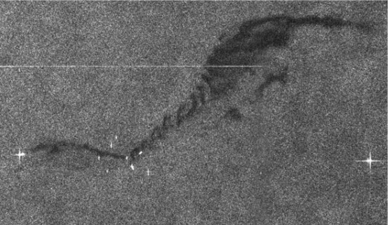
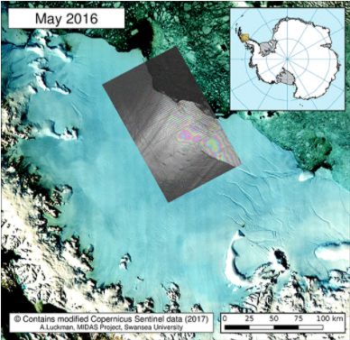
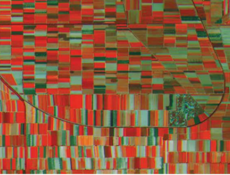
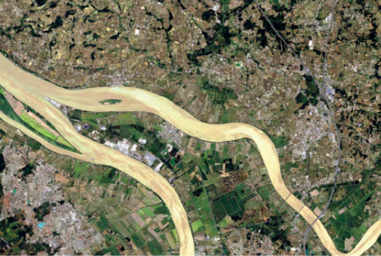
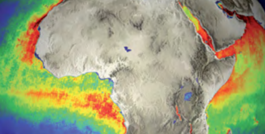
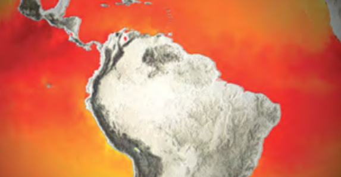
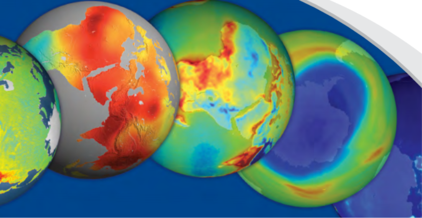

@a2beckj

# Copernicus

Copernicus ist das Erdbeobachtungsprogramm der Europäischen Union, das sich mit unserem Planeten und seiner Umwelt zum größtmöglichen Nutzen aller europäischen Bürger befasst. Es bietet Informationsdienste auf der Grundlage von satellitengestützter Erdbeobachtung und Nicht-Weltraum-Daten an.

Ziele:
* Umweltschutz
* Unterstützung von Zivilschutz und Sicherheitsbemühungen
* Unterstützung eines nachhaltigen Zuwachses der EU-Wirtschaft

Eine Übersicht der aktuellen Forschungprjekte findet sich [hier](https://www.copernicus.eu/en/documentation/research-projects).

Insgesamt 5 eigenständige Satelliten und 2 spezielle Messinstrumente, die auf Satelliten von EUMETSAT mitfliegen.

### Satelliten

#### Sentinel-1

 
  Abb 1: Ölverschmutzung nähe der Belgischen Küste 2015  Quelle: https://sentinel.esa.int/

  Abb 2: Überwachung der Entwicklung eines antarktischen Eisschildes  Quelle: https://sentinel.esa.int/

* Radar kann in vier verschiedenen Beobachtungsmodi mit unterschiedlicher Auflösung arbeiten
* Lieferung von Daten über Land- und Wasseroberflächen, unabhängig von Helligkeit und Wolkenbedeckung
* Ermöglicht zeitnahe Aufnahmen von: 
  - Überschwemmungen an Land
  - Ölverschmutzungen auf dem Meer
  - Zeitreihen kleinster Bodenbewegungen oder der Vegetationsdichte
* Sentinel-1B (B = 2te Satellit der Sentinel-1 Satellitenreihe) wurde 2016 gestartet
* Weitere Beispielbilder sieht man [hier](https://eos.com/sentinel-1/).

  
#### Sentinel-2

  Abb 3: Falschfarben Bild zur Darstellung von chlorophyll Verteilungen in Vegetation  Quelle: https://www.d-copernicus.de/

  Abb 4: Hochauflösendes Satellitenbild   Quelle: https://www.d-copernicus.de/

* liefern Aufnahmen im sichtaren und infraroten Spektrum (443 - 2190nm)
* 13 Kanäle zur Beobachtung der Landoberflächen
* Auflösung von bis zu 10m, Abtastbreite von 290km
* Ermöglicht Veränderungen der Vegetation zu erkennen, um:
  - Erntevorhersagen zu erstellen
  - Waldbestände zu kartieren 
  - Wachstum von Wild- und Nutzpflanzen zu bestimmen
  - Algenwachstum an Küsten- und Binnengewässern beobachten
  - Sedimenteintrag in Flussdeltas nachzuverfolgen
* Sentinel-2B wurde 2017 gestartet
* Beispielbilder sieht man [hier](https://eos.com/sentinel-2/).

#### Sentinel-3

  Abb 5: Marines Chlorophyll   Quelle: https://www.d-copernicus.de/

  Abb 6: Temperatur der Meeresoberfläche   Quelle: https://www.d-copernicus.de/

* nutzt ein Paket aus 5 Instrumenten
* hochpräzise Bestimmung der Temperatur, der Farbe und des Pegels der Meeresoberfläche
* Ermöglicht Erkenntnisse über:
  - Unterwasserströmungen
  - Wellenhöhen
  - Nährstoffverteilung in den Weltmeeren
  - Energiehaushalt des Planeten
  - Wasserqualität oder Umweltverschmutzung an den Küsten
* Bestimmung des Orbits mit 3 cm Genauigkeit 
* Radiometrische Genauigkeit von 3 K absolut (0,6 K relativ)
* Sentinel-3B wurde 2018 gestartet

#### Sentinel-5P

  Abb 7: Darstellung der Konzentration der Atmosphärengase   Quelle: https://www.d-copernicus.de/

* Messungen siehe Sentinel-5
* Fliegt nurnoch solange, bis Messinstrumente auf Satelliten von EUMETSAT mitfliegen werden.
* Ist seit 2017 im Einsatz

#### Sentinel-6

* Jahreszeitliche Messreihen zu den Meeresspiegehöhen
* Set aus hochpräzsen Ortungsinstrumenten (Radar-Höhenmesser, Mikrowellen-Radiometer -> zentimetergenaue Bestimmung der Meeresoberflächen)
* Daten zu Windgeschwindigkeiten, Meeresströmungen und Wellen
* Noch in der Entwicklung, Start ist für den 15.11.2020 geplant
* Vorläufersystem 2016 gestartet, wird von EUMETSAT betrieben

### Messinstrumente EUMETSAT-betrieben
EUTMETSAT: „Europäische Organisation für die Nutzung meteorologischer Satelliten“, Sitz: Darmstadt 

#### Sentinel-4

* Daten über Konzentration von Schadstoffen in der Luft
* Dient auch zur Überwachung von Klimaprotokollen
* Stündliche Messungen von Ozonbelastung, Feinstaubgehalt, Luftqualität
* Erster Einsatz auf einem Meteosat soll 2022 erfolgen
* Der [Messvorgang] (https://earth.esa.int/web/guest/missions/esa-future-missions/sentinel-4/) umfasst ein hochauflösendes Spektrometersystem, das mit 3 Bändern im  ultravioletten, sichtbaren und im Bereich des nahen Infrarots des Reflexionsspektrum des Sonnenlichts arbeitet und diese Bereiche sichtbar macht.
* Die jeweilige spektrale Auflösung beträgt 0,5 nm im ultravioletten und sichtbaren Bereich und 0,12 nm im nahen Infrarot Bereich.
* Die abgeleiteten Datenprodukte umfassen die optische Tiefe von O3, NO2, SO2, HCHO und Aerosol.

#### Sentinel-5

* Mission zu Messung von Atmosphärengasen weltweit (Methan, Ozon, Stickstoff, Aerosole)
* will komplexe Prozesse in der Erdatmosphäre sichtbar machen
* Erster Einsatz soll 2022 auf neuer Generation des polaren EUMETSAT Systems, [MetOp-SG] (https://earth.esa.int/web/eoportal/satellite-missions/m/metop-sg), erfolgen

## Zeitplan

  Abb 8: Copernicus Constellation deployment schedule   Quelle: https://www.d-copernicus.de/

## Allgemeine Geschäftsbedingungen für die Nutzung der Copernicus-Daten

Nutzer der Daten haben das Recht:
* die Daten in einer beliebigen Weise zu Nutzen, zu verändern und zu modifizieren und dadurch geänderte Produkte herzustellen
* die Daten an weitere Nutzer, Auftragnehmer und andere Teilnehmer in Rahmen von Projekten weiterzugeben, solange diese die Allgemeinen Geschäftsbedingungen akzeptieren.
* die Daten in unbegrenzter Anzahl zu kopieren.
* Sentinel-Daten, abgeänderte Produkte und abgeleitete Werke in gedruckten oder digitalen Medien zu veröffentlichen. Dies umfasst nicht den Download oder die Rekonstruktion der Sentinel-Daten oder veränderter Produkte, solange die Anforderungen der Datenweiterleitung nicht erfüllt sind.
* Sentinel-Daten, und die von ihnen geänderten Produkte und abgeleiteten Werke zu verteilen, solange die Empfänger die Allgemeinen Geschäftsbedingungen zur Kenntniss nehmen.

* Das geistige Eigentum der primären und veränderten Produkte bleibt beim Besitzer der Satelliten. Wann immer die Daten geteilt, veröffentlicht oder auf andere Weise zur Verfügung gestellt werden, muss der Nutzer diese eindeutig mit einem Copyright-Zeichen wie folgt versehen: „© Copernicus Daten (Jahr des Abrufs) “
* Das geistige Eigentum von Derivaten, die vom Benutzer erstellt wurden
gehört dem Benutzer. Abgeleitete Werke sind bei Veröffentlichung, Teilen oder jeglicher anderer Form der Bereitstellung wie folgt zu kennzeichnen: “enthält Copernicus-Daten (Jahr des Abrufs) ”.

## Datenzugriff

### Lokal

1. Auf Copernicus Open Access Hub [registrieren](https://scihub.copernicus.eu/userguide/SelfRegistration)

#### Manuell

1. [Einloggen](https://scihub.copernicus.eu/dhus/#/home)
2. Bereich selektieren
3. Produkte suchen
4. Produkte auswählen und herunterladen

Die Dateiformate die heruntergeladen werden und die Dateigrößen sind abhängig vom ausgewählten Produkt.

#### Python API

Nutzerdokumentation gibt es auf [GitHub](https://github.com/sentinelsat/sentinelsat) oder [hier](https://sentinelsat.readthedocs.io/en/stable/).

* Protokoll: Open Data Protocol (OData), Schnittstelle für den Zugriff auf Copernicus Sentinel.
* **Es dauert bis zu einer Woche bis die Nuterdaten für die API Nutzung aktiviert/aktualisiert werden. Frühzeitig registrieren!**
* Daten werden lediglich 12 Monate online vorgehalten. Beim versuchten Zugriff auf ältere Daten wird automatisch ein Abruf aus dem Langzeitarchiv angefordert. Der eigentliche Download kann vom Benutzer nach Wiederherstellung der Daten (innerhalb von 24 Stunden) initiiert werden. Ein Benutzerkontingent für die maximale Anzahl von Anforderungen pro Stunde und Benutzer wird festgelegt. Aus den Langzeitarchiven restaurierte Produkte werden mindestens 3 Tage lang online aufbewahrt.
* Dateigröße ca. 1GB pro Datei

### Cloud

s. Datenverarbeitung

## Datenverarbeitung

### Lokal

Im Rahmen des Copernicus-Programms wurde für die Vorverarbeitung der Satellitendaten die OpenSource-Software **[SNAP](https://step.esa.int/main/toolboxes/snap/) (Sentinel Application Platform)** entwickelt. Mit der Software können Verarbeitungsketten vorbereitet werden, an deren Ende gebrauchsfähige und per GIS auswertbare „Satellitenbilder“ stehen.

### Cloud

* Europäische Kommission hat den Einsatz von fünf Cloud-basierten Plattformen finanziert, die einen zentralen Zugang zu Copernicus-Daten und -Informationen sowie zu Verarbeitungswerkzeugen ermöglichen. Diese Plattformen werden als DIAS (Data and Information Access Services) bezeichnet.
* ermöglichen es den Nutzern, Copernicus-Daten und -Informationen aufzufinden, zu handhaben, zu verarbeiten und herunterzuladen. Alle DIAS-Plattformen bieten Zugang zu den Daten von Copernicus Sentinel sowie zu den Informationsprodukten aus den sechs Betriebsdiensten von Copernicus sowie zu Cloud-basierten Tools.
* Jede der fünf konkurrierenden Plattformen bietet auch Zugang zu zusätzlichen kommerziellen Satelliten- oder Nicht-Weltraum-Datensätzen sowie Premium-Angeboten in Bezug auf Support oder Priorität. 
* Dank eines einzigen Zugangspunktes für die gesamten Copernicus-Daten und -Informationen **ermöglicht DIAS den Benutzern die Entwicklung und das Hosting ihrer eigenen Anwendungen in der Cloud, ohne dass voluminöse Dateien von mehreren Zugangspunkten heruntergeladen und lokal verarbeitet werden müssen.** 

* Auf kostenfreier Basis sind die Möglichkeiten bei den Anbietern aber sehr beschränkt, gerade im Bereich von Speicher- und Rechenkapazität.Auf virtuelle Maschinen kann in den kostenfreien Versionen nicht zurückgegriffen werden.
* Das [gitHub repository von der DIAS Plattform WEkEO](https://github.com/wekeo/wekeo-jupyter-lab) bietet gute Anhaltpunkte und Beispiele, wie auf die unterschiedlichen Sentinel Daten zugegriffen werden kann und wie diese verarbeitet werden können bzw. welche Bibliotheken in diesem Zusammenhang hilfreich sind.

      

Die Anbieter bieten unterschiedliche APIs und Funktionalitäten in verschiedenen Abrechnungsmodularitäten an. Im kostenfreien Bereich ist die Funktionalität in Bezug auf Rechen- und Speicherkapazität sehr eingeschränkt!
Vergleich der Anbieter und Produkte [hier](https://earsc.org/dias-comparison/).

Neben den DIAS Diensten gibt es ebenfalls die [Google Earth Engine](https://developers.google.com/earth-engine/datasets), welche als Archiv für Sentineldaten dient, die in jede Programmierumgebung importiert werden können. Ein Hochladen unterschiedlichster Raster- und Vektodaten ist dort ebenfalls möglich. 

## Quellen

### Literaturverzeichnis
- https://www.copernicus.eu/en
- https://www.d-copernicus.de/daten/satelliten/daten-sentinels/
- https://developers.google.com/earth-engine/datasets
- https://www.copernicus.eu/de/datenzugriff/dias

### Abbildungsverzeichnis
- Abb. 1 & 2: https://sentinel.esa.int/web/sentinel/user-guides/sentinel-1-sar/applications/maritime-monitoring (Abruf: 21.10.2020)
- Abb. 3: https://www.d-copernicus.de/fileadmin/Content/Bilder/sentinels/SENTINEL-2_sheet_170125_1_.pdf (Abruf: 21.10.2020)
- Abb. 4: https://www.d-copernicus.de/fileadmin/Content/pdf/Sentinel-2_Colour_visions_brosch%C3%BCre_eng.pdf (Abruf: 21.10.2020)
- Abb. 5&6: https://www.d-copernicus.de/fileadmin/Content/pdf/Sentinel-3_A_bigger_picture_brosch%C3%BCre_engl.pdf (Abruf: 21 10. 2020)
- Abb. 7: https://www.d-copernicus.de/fileadmin/Content/pdf/Sentinel-5p_factsheet_171211.pdf (Abruf: 21.10.2020)
- Abb. 8: https://www.d-copernicus.de/fileadmin/Content/pdf/Forum_2017/04_COP-Nutzertage2017_COP-NG.pdf (Abruf: 21.10.2020)

