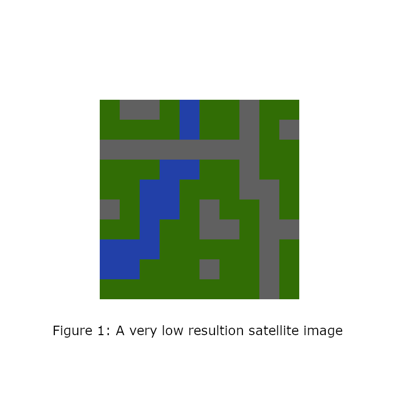
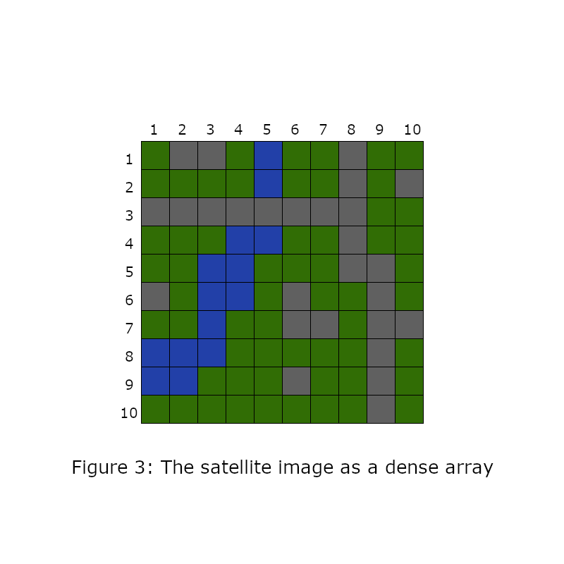
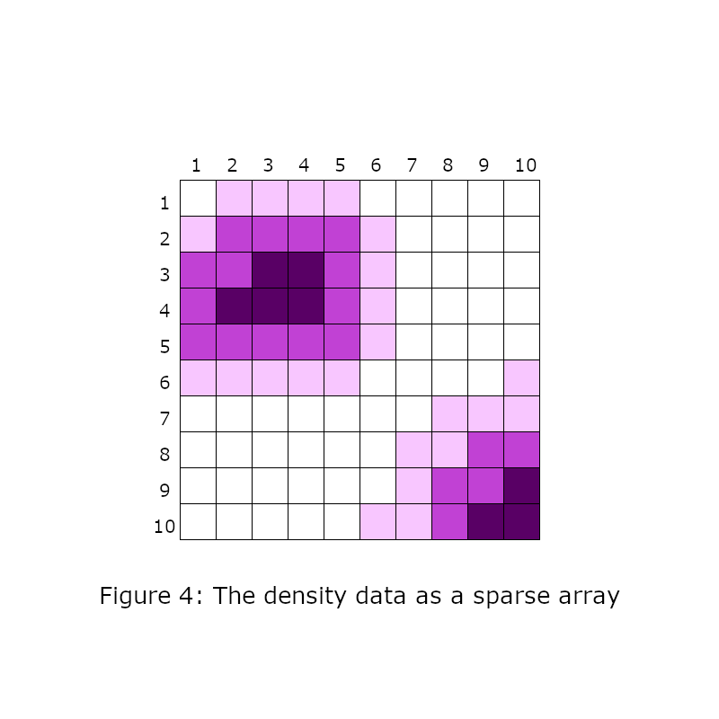
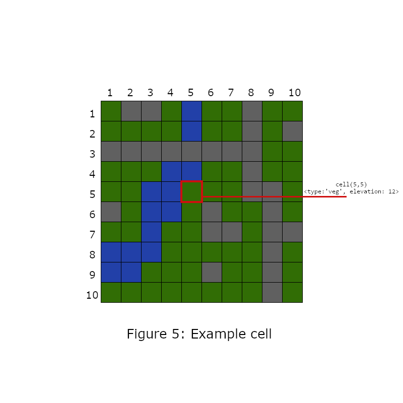
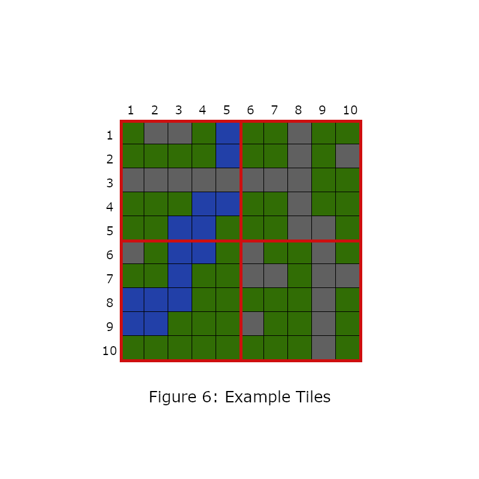
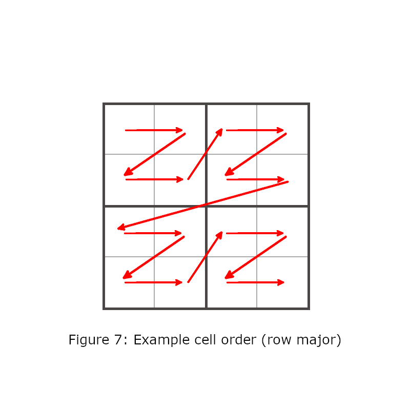

# **[TileDB](https://tiledb.com/) The Universal Data Engine**
### By Fabian Fermazin

## 1. What is TileDB?

### 1. 1. Introduction

#### 1. 1. 1. Brief project history

TileDB is a database project with the self proclaimed goal to go beyond existing data storage structures[1]. TDB spun off MIT and Intel Labs. It has two components a open source [C++](https://en.wikipedia.org/wiki/C%2B%2B) library called **TileDB embedded** and a commercial [SARS](https://en.wikipedia.org/wiki/Software_as_a_service) platform called **TileDB cloud**.

We will focus on **TileDB embedded** since the TDB Cloud is an extension of the other component and a closer inspection would be out of scope for this presentation.

#### 1. 1. 2. Central problem

Most of you will have attended the module about [databases](https://en.wikipedia.org/wiki/Database) or have at least some experience with one. So the terms [relational](https://en.wikipedia.org/wiki/Relational_model) and [key-value](https://en.wikipedia.org/wiki/Key%E2%80%93value_database) data model should be familiar enough. But these database models and their implementations have some drawbacks. They rely on a single data type, the querying engines can be restrictive and most of them have trouble with cloud storage [2].

The TileDB developers had these problems in mind when creating the initial idea for their database. Their concept has two main difference to most DBs. The primitive type of TileDB storage is the multidimensonal [array](https://en.wikipedia.org/wiki/Array_data_structure) (for more Info see 1.3.). This allows in general for more diverse data structures to be stored in the DB [3].

The second difference is that they made the [access and computation](https://en.wikipedia.org/wiki/Data_access_layer) of their DB 'pluggable'. That means that are not bound to e.g. [SQL](https://en.wikipedia.org/wiki/SQL) but you can choose in which way you want to access your data. [4]

### 1. 2. Universal Data Engine

The above mentioned attributes of TileDB make it in the words of the developers a universal data Engine. Broken down this means: 'It can store almost anything and you can access it through almost anything.'  
The need for a universal format comes from the experience that the head developer had when seeing the vast sea of file formats and data storages used in the different academic fields. [5]

An example which illustrates the usefulness of TileDBs universal access in a geoinformatics context:

Say you want to use and edit the same dataset of raster data in a leaflet Map ([R](https://en.wikipedia.org/wiki/R_(programming_language)) based) and in QGIS ([python](https://en.wikipedia.org/wiki/Python_(programming_language)) based). If you have this raster data in the TileDB format you could access it through the corresponding api and would have to convert at all. And if some other programmer wants to use it although he/she only knows [GO](https://en.wikipedia.org/wiki/Go_(programming_language)). He/She would be able to join in with no problem.

### 1. 3. Data Model

To more fully understand these rather grand concepts we will now go through the conversion of some simple example geospatial data and explain the most important concepts of the TDB data model.

Lets assume we have two raster data sets as GeoTIFFs. One is satellite image of a town and the other is some density data.

  

\
Now these two datasets will be transformed into 2 dimensional TDB arrays. Every pixel will be translated into a cell of the array. The result of example 1 will be a [dense array](https://en.wikipedia.org/wiki/Sparse_matrix) array where as example 2 will result in a [sparse array](https://en.wikipedia.org/wiki/Sparse_matrix). The difference being that the density data has lot a cells which have the value zero.  
The have now two axes which have the domains of integers from 1 to 10. But in TDB you could theoretically use more domains types like floats or strings [6]. In Figures 3 and 4 you see a representation of this translation.

\
A cell has now coordinates and some attributes. These attributes could represent anything important:
  - The rgb values
  - Landclassification
  - Elevation
  - etc.

\
But the method of querying such an TDB array is different to the standard query through [coordinates](https://en.wikipedia.org/wiki/Array_data_structure#Element_identifier_and_addressing_formulas). Instead TDB uses a systems of tiles. A tile in this context is a uniform section of the array. The array is divided into fixed amount of these tiles [7]. This concept is also used in e.g. the OGC [Web Map Tile Sevice](https://en.wikipedia.org/wiki/Web_Map_Tile_Service).

\
The cells and tiles will be assigned number following a pattern. The different cell orders are described [here](https://docs.tiledb.com/main/basic-concepts/terminology#global-cell-order). This makes the query in practice one dimensional. This has major benefits when indexing sparse arrays.

  

\
So these are the basics of how TBA Arrays work. If you want to find out more you can read the [docs](https://docs.tiledb.com/main/).

## 2. How can it be used in geoinformatics?

This project has lot of promise for geoinfromatics because geospatial data was one the key use cases the deleopers had in mind [5]. The array data format as shown above can be used for 2D raster data. But it can also represent other data like a point cloud as a sparse 3D array or data with time component.

The array format is really cloud friendly, which makes it a good solution for the ever growing data files. And you can integrate it different programming languages at the same time.  It has also Integration with some geospatial libraries like [GDAL](https://en.wikipedia.org/wiki/GDAL), [PDAL](https://pdal.io/) or [rasterio](https://github.com/mapbox/rasterio) [8].

The fast slicing which is enabled through the special data indexing is also very practical for geoinformatics. So that you can get subarrays of areas of interest fast.

## 3. Personal experience   

I have tried the R api of TDB embedded. Unfortunately i'm not the greatest in R and the [R api](https://tiledb-inc.github.io/TileDB-R/reference/index.html) is rather poorly documented in my opinion at least in contrast to [Python and C++ versions](https://tiledb-inc-tiledb.readthedocs-hosted.com/en/1.6.3/index.html). So my experience is pretty limited. But i managed to set up a simple dense array. This is however the script is more less copie and pasted from the [tdb docs](https://docs.tiledb.com/main).

In my experience it is rather complicated to set up a simple array. But you can really finetune every little bit  and in the end i think you really have a powerful data structure. However i would presue TDB embedded in R because of the lack of documentation and would turn to the Python api. Then you could test the interoperability between Python and R. I have included the commented R script in this folder so you can see these points in more detail.

Also i have tried to run the TDB geospatial docker image. The download works just fine unfortunately i am not able to get it to read my files from the windows directories. Maybe this isn't an issue in Linux. But as it stands i can not say anymore about this particular program.

>EDIT:
After learning something about Docker volumes i could get TDB geospatial running. After that i tried to get the produced array to open in R. This was no problem but i could not access the array because R could not interact with the dimensions and therefore the data of the array. The reason for this is that R apparently has trouble handeling [UInt64](https://docs.microsoft.com/de-de/dotnet/api/system.uint64?view=netcore-3.1) values.  
>
>At this point i switched to the python version which has not this problem and is more intuitive. And i have made a additional demo which involves TDB geospatial and the python version. For the instructions see [here](./python_demo_instructions.md).  

## 4. Conclusion

So these are key things you should keep in mind about TileDB:

Database Feature | TileDB
-----|----
Primitive data type | Multidimensional Arrays
Writing/Reading Access | Cell and Tile Order => 1D
Supported Languages (ATM) | C, C++, Python, R, Java and Go
Supported geospatial libraries | GDAL, PDAL, rasterio, SAR, MapServer

## 5. Annex

### 5. 1. Abbreviations
- DB
  : Database.
- TDB
  : TileDB.

## 5. 2. Sources

[1]: TileDB, Inc. (n.d.): *The universal Data Engine*. https://tiledb.com/ Retrieved 30.10.2020  
[2]: TileDB, Inc (n.d.): *The Problem* In *TileDB Docs* https://docs.tiledb.com/main/the-problem#monolithic-databases Retrieved 30.10.2020   
[3]: Baer, T. (2020) *TileDB introduces canonical database storage format*. ZDNet https://www.zdnet.com/article/tiledb-introduces-canonical-database-storage-format/ Retrieved 29.10.2020  
[4]: businesswire (2020) *TileDB Closes $15M Series A for Industry’s First Universal Data Engine; Two Bear Capital Leads Round*. https://www.businesswire.com/news/home/20200714005280/en/TileDB-Closes-15M-Series-Industry%E2%80%99s-Universal-Data Retrieved 29.10.20  
[5]: Macey, T. (Host). (2020) *Exploring The TileDB Universal Data Engine -Episode 146* In *Data Engineering Podast*. https://www.dataengineeringpodcast.com/tiledb-universal-data-engine-episode-146/  
[6]: TileDB, Inc (n.d.): *Data Model* In *TileDB Docs* https://docs.tiledb.com/main/basic-concepts/data-model Retrieved 30.10.2020  
[7]: TileDB, Inc (n.d.): *Data Format* In *TileDB Docs* https://docs.tiledb.com/main/basic-concepts/data-format Retrieved 30.10.2020  
[8]: TileDB, Inc (n.d.): *Introduction* In *TileDB Geospatial* https://docs.tiledb.com/geospatial/ Retrieved 30.10.2020
